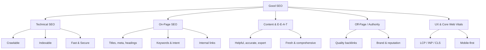

# SEO Rules & Criteria — Knowledge Base for AI Agents

<aside>
🤖

**Purpose:** This is a structured knowledge base of search engine optimization (SEO) criteria and best practices, written as rules for an AI agent. Feed this into your agent's context or link it from your markdown rules so it can reason about SEO decisions consistently. Each section uses *imperative rules* the agent can apply directly.

</aside>

## 0. Core Principles (Read First)

1. **Optimize for users first, search engines second.** Google's systems reward content built for people, not for ranking tricks. Every rule below is in service of being genuinely useful, findable, and trustworthy.
2. **Search engines do three things:** *crawl* (discover pages), *index* (store and understand them), and *rank* (order them for a query). A page must succeed at all three stages to get traffic. If it can't be crawled, indexing and ranking are impossible.
3. **Relevance + Quality + Authority + Experience.** Ranking is a function of how relevant a page is to the query, how high-quality and trustworthy the content is, how authoritative the site/page is (links, reputation), and how good the user experience is.
4. **There is no single "SEO score."** SEO is the sum of hundreds of signals across technical, on-page, content, off-page, and UX dimensions. Treat it as a checklist of compounding factors, not one number.
5. **Intent is king.** Match the page to *why* someone searches (informational, navigational, commercial, transactional). The right answer in the wrong format will not rank.

---

## 1. Search Intent & Keyword Research

### 1.1 Classify search intent

Every target keyword falls into one of four intents. Always classify before creating content:

| Intent | User wants | Best content format |
| --- | --- | --- |
| Informational | To learn / answer a question | Guides, how-tos, definitions, blog posts |
| Navigational | To reach a specific site/brand | Branded landing/home pages |
| Commercial | To research before buying | Comparisons, reviews, "best of" lists |
| Transactional | To take action / buy now | Product, pricing, signup, category pages |

### 1.2 Keyword research rules

- **Build around topics, not isolated keywords.** Map a primary keyword plus semantically related terms, synonyms, and questions (a "topic cluster").
- **Evaluate each keyword on three axes:** search volume (demand), keyword difficulty (competition), and business relevance (conversion value). Prioritize high-relevance terms you can realistically rank for.
- **Target long-tail keywords** (3+ words, specific) for new/low-authority sites — lower competition and higher intent.
- **Read the SERP before writing.** The current top 10 results reveal the intent, format, depth, and angle Google rewards. Match or exceed it.
- **One primary keyword (and intent) per page.** Don't make two pages compete for the same term (keyword cannibalization).
- **Capture "People Also Ask" and related questions** as subheadings and FAQ content.

---

## 2. On-Page SEO

On-page = everything on the page itself that you control. These are the highest-leverage, easiest-to-fix signals.

### 2.1 Title tag (`<title>`)

- Include the primary keyword, ideally near the front.
- Keep ~50–60 characters (~600px) so it isn't truncated in the SERP.
- Make it unique per page, compelling, and click-worthy. One title tag per page.
- Front-load value; add the brand name at the end where appropriate.

### 2.2 Meta description

- **Mandatory book.toml description:** Every book's `book.toml` MUST explicitly set `description = "..."` under `[book]` (100–160 chars). This triggers mdBook to automatically inject `<meta name="description" content="...">` into every compiled chapter page.

- 140–160 characters; summarize the page and include the primary keyword naturally.
- It does **not** directly affect ranking, but it strongly affects click-through rate (CTR), which matters.
- Write it as ad copy with a clear value proposition / call to action. Unique per page.

### 2.3 Headings (H1–H6)

- Exactly **one H1** per page; it should state the page topic and include the primary keyword.
- Use H2/H3 to create a logical, hierarchical outline. Don't skip levels for styling.
- Include keyword variations and related questions in subheadings.

### 2.4 URL structure

- Short, descriptive, lowercase, hyphen-separated words. Include the primary keyword.
- Avoid stop words, dates, parameters, and random IDs where possible.
- Keep a shallow, logical folder hierarchy (e.g. `/category/subcategory/page`).
- Good: `example.com/seo/keyword-research` — Bad: `example.com/p?id=8842&cat=3`

### 2.5 Body content & keyword usage

- Place the primary keyword in the first ~100 words, naturally.
- Use synonyms, entities, and related terms (semantic SEO) rather than repeating the exact keyword (avoid keyword stuffing).
- Cover the topic comprehensively — answer the main question *and* the obvious follow-ups.
- Use short paragraphs, lists, tables, and descriptive subheadings for scannability.
- Write for featured snippets: give a concise, direct answer (40–60 words) near the top, then expand.

### 2.6 Internal linking

- Link to related pages using **descriptive, keyword-relevant anchor text** (not "click here").
- Link from high-authority pages to important pages you want to rank (passes link equity).
- Build topic clusters: a pillar page links to all cluster pages, and they link back.
- Keep important pages within ~3 clicks of the homepage.
- Fix orphan pages (pages with no internal links pointing to them).

### 2.7 Images & media

- Use descriptive file names (`blue-running-shoes.jpg`, not `IMG_2931.jpg`).
- Write meaningful **alt text** for accessibility and image SEO; include keywords only when relevant.
- Compress images and serve next-gen formats (WebP/AVIF). Specify width/height to avoid layout shift.
- Use lazy loading for below-the-fold media.

### 2.8 Outbound links

- Link to authoritative, relevant external sources where it helps the reader; it signals trust and context.
- Use `rel="nofollow"` / `sponsored` / `ugc` for paid, untrusted, or user-generated links.

---

## 3. Content Quality & E-E-A-T

Google evaluates content quality heavily, especially via **E-E-A-T**: Experience, Expertise, Authoritativeness, Trustworthiness. Trust is the most important member.

### 3.1 E-E-A-T rules

- **Experience:** Show first-hand or real-world experience with the topic (original photos, tests, case studies, "I used this").
- **Expertise:** Content should be created or reviewed by someone knowledgeable. Show author credentials and bios.
- **Authoritativeness:** Build recognition as a go-to source (citations, mentions, links, brand reputation).
- **Trustworthiness:** Be accurate, transparent, and honest. Cite sources, show dates, provide contact info, secure the site (HTTPS).

### 3.2 "Helpful content" rules

- Create content for a clear target audience that finds it genuinely useful.
- Demonstrate first-hand expertise and depth — not thin, rehashed summaries of what already ranks.
- Satisfy the user so they don't need to return to search ("search journey complete").
- Avoid writing primarily to chase search engines, hitting an arbitrary word count, or covering topics outside your site's purpose.
- Avoid mass-produced, low-effort, or unedited AI content. AI assistance is fine; low quality is not, regardless of how it's produced.

### 3.3 YMYL (Your Money or Your Life)

- Pages affecting health, finance, safety, legal, or major life decisions are held to a **higher quality and trust bar**. Require strong expertise, sourcing, and accuracy for these topics.

### 3.4 Content maintenance

- Keep content fresh: update facts, stats, screenshots, and dates. Stale content decays in rankings.
- Prune or consolidate thin, outdated, or duplicate pages (improve, merge, redirect, or remove).
- Avoid duplicate content; use canonical tags to point to the preferred version.

---

## 4. Technical SEO

Technical SEO ensures search engines can crawl, render, and index the site, and that the site is fast and stable.

### 4.1 Crawlability

- Provide an XML **sitemap** listing canonical, indexable URLs; submit it in Google Search Console.
- Use **robots.txt** to guide crawlers; never accidentally block CSS/JS or important pages.
- Maintain a logical site architecture and internal links so crawlers can reach every important page.
- Watch crawl budget on large sites: eliminate crawl traps, infinite spaces, and low-value parameter URLs.

### 4.2 Indexability

- Use `meta robots` (`index/noindex`, `follow/nofollow`) deliberately. Don't `noindex` pages you want to rank.
- Use **canonical tags** (`rel=canonical`) to consolidate duplicate/near-duplicate URLs to one version.
- Avoid duplicate content from URL parameters, http/https, www/non-www, trailing slashes, and pagination.
- Verify indexing status in Search Console; investigate "Crawled – currently not indexed" and "Discovered – not indexed."

### 4.3 Site structure & URLs

- Flat, shallow hierarchy; consistent URL patterns.
- Use **breadcrumbs** (with structured data) for navigation and context.
- One canonical domain version; enforce with 301 redirects.

### 4.4 HTTPS & security

- Serve the entire site over **HTTPS** (a confirmed ranking signal). Fix mixed-content warnings.

### 4.5 Redirects & status codes

- Use **301** (permanent) for moved content; avoid redirect chains and loops.
- Return correct status codes: 200 (OK), 404 (gone, with a helpful page), 410 (permanently gone), 5xx (fix server errors fast).
- Audit and fix broken internal/external links regularly.

### 4.6 Rendering & JavaScript

- Ensure critical content and links are available without requiring heavy client-side JS, or use SSR / dynamic rendering / hydration so Google can index content.
- Don't hide primary content behind interactions that crawlers won't perform.

### 4.7 International SEO

- Use **hreflang** tags to signal language/region variants and prevent the wrong version from ranking.
- Keep a consistent URL strategy (subdirectory, subdomain, or ccTLD) per locale.

---

## 5. Core Web Vitals & Page Experience

Google's **page experience** signals reward fast, stable, usable pages. The core metrics:

| Metric | Measures | Good threshold |
| --- | --- | --- |
| LCP (Largest Contentful Paint) | Loading — when main content appears | ≤ 2.5 s |
| INP (Interaction to Next Paint) | Responsiveness to input | ≤ 200 ms |
| CLS (Cumulative Layout Shift) | Visual stability | ≤ 0.1 |

<aside>
📌

Note: INP replaced FID (First Input Delay) as a Core Web Vital in 2024. Use INP going forward.

</aside>

### 5.1 Performance rules

- Optimize and compress images (WebP/AVIF), lazy-load offscreen media, and set explicit dimensions (prevents CLS).
- Minify CSS/JS, defer non-critical JS, eliminate render-blocking resources, and inline critical CSS.
- Use a CDN, caching, and modern compression (Brotli/Gzip). Improve server response time (TTFB).
- Preload key resources (fonts, hero image). Avoid layout shifts from late-loading fonts, ads, or banners.
- Reduce main-thread work and large JS bundles to improve INP.

### 5.2 Other page-experience factors

- **Mobile-friendliness** (see §6).
- **No intrusive interstitials** (pop-ups that block content, especially on mobile).
- HTTPS and safe browsing (no malware/deceptive content).

---

## 6. Mobile SEO

- Google uses **mobile-first indexing**: it crawls and ranks based on the *mobile* version of your site. The mobile version must contain the same content, structured data, and metadata as desktop.
- Use **responsive design** (preferred) so one URL serves all devices.
- Ensure readable font sizes, adequate tap-target spacing, no horizontal scrolling, and fast mobile load times.
- Test with mobile usability tools; fix viewport and content-width issues.

---

## 7. Structured Data (Schema Markup)

- Add [**schema.org](http://schema.org) structured data** (prefer JSON-LD) so search engines understand entities and can show **rich results** (stars, FAQs, prices, breadcrumbs, events, recipes, etc.).
- Match schema type to content: `Article`, `Product`, `FAQPage`, `HowTo`, `Recipe`, `Review`, `Organization`, `LocalBusiness`, `BreadcrumbList`, `Event`, `VideoObject`, etc.
- Only mark up content that is **actually visible** on the page; don't mark up fake or hidden content (against guidelines).
- Validate with the Rich Results Test / Schema validator. Keep markup accurate and current.
- Structured data doesn't directly boost rankings but improves CTR and eligibility for enhanced SERP features.

---

## 8. Off-Page SEO & Authority

Off-page = signals from *outside* your site, primarily backlinks and reputation. Backlinks remain one of the strongest ranking factors.

### 8.1 Backlink rules

- **Quality > quantity.** A few links from authoritative, topically relevant sites beat many low-quality links.
- Evaluate links by: authority/trust of the linking domain, topical relevance, anchor text, placement (in-content vs footer), and dofollow vs nofollow.
- Earn links through genuinely link-worthy assets: original research, data, tools, definitive guides, and strong content ("link bait").
- Use digital PR, guest contributions, expert quotes, and partnerships to build links naturally.
- Maintain a **natural anchor-text profile** (branded, naked URL, generic, and partial-match — not all exact-match).
- Disavow or clean up toxic/spammy links only when there's a clear manual-action or negative-SEO problem.

### 8.2 Avoid link schemes (will trigger penalties)

- Buying/selling links that pass PageRank, excessive link exchanges, large-scale article/guest-post spam with keyword-rich anchors, automated link building, and private blog networks (PBNs).

### 8.3 Brand & entity signals

- Build brand awareness and unlinked brand mentions; Google increasingly understands brands as entities.
- Maintain consistent NAP (Name, Address, Phone) and profiles across the web.
- Manage reviews and online reputation (supports trust/E-E-A-T).

---

## 9. Local SEO (for businesses with a location/service area)

- Create and fully optimize a **Google Business Profile** (categories, hours, photos, services, posts).
- Ensure **consistent NAP** across the site and all directories/citations.
- Earn and respond to **reviews**; review quantity, quality, and recency matter for the local pack.
- Build local citations and locally relevant backlinks.
- Create location- and service-specific pages with local intent keywords.
- Add `LocalBusiness` structured data and embed a map.

---

## 10. Measurement, Tools & Monitoring

### 10.1 Essential tools

- **Google Search Console** — indexing status, queries, impressions/clicks/CTR/position, Core Web Vitals, manual actions, sitemaps.
- **Google Analytics (GA4)** — traffic, engagement, conversions from organic.
- **PageSpeed Insights / Lighthouse / CrUX** — performance and Core Web Vitals (lab + field data).
- Third-party suites (Ahrefs, Semrush, Moz, Screaming Frog) — keyword research, backlinks, rank tracking, technical crawls.

### 10.2 KPIs to track

- Organic traffic and organic conversions / revenue.
- Keyword rankings and ranking distribution; share of voice.
- Impressions, clicks, and CTR by query and page (Search Console).
- Indexed page count vs. submitted; crawl errors.
- Backlink growth and referring domains.
- Core Web Vitals pass rate; bounce/engagement and dwell time as proxies.

### 10.3 Process rules

- Run periodic **technical audits** (crawl errors, broken links, redirects, duplicates, indexation, speed).
- Do **content audits**: identify decaying pages, refresh winners, prune losers.
- Monitor algorithm updates and your own analytics for drops; diagnose by segment (page type, query type, device).
- SEO compounds over months — measure trends, not day-to-day noise.

---

## 11. What to Avoid (Black-Hat / Penalty Risks)

These violate search guidelines and risk ranking suppression or manual penalties:

- Keyword stuffing and hidden text/links (white text, tiny fonts, off-screen text).
- Cloaking (showing different content to crawlers vs users) and sneaky redirects.
- Doorway pages and scaled, low-value auto-generated content created mainly to manipulate rankings.
- Link schemes, paid links that pass PageRank, and PBNs.
- Scraped, spun, or duplicate content with no added value.
- Misleading structured data / fake reviews.
- Intrusive interstitials that block content.
- Negative-SEO tactics. **Rule: if a tactic exists only to trick search engines, don't do it.**

---

## 12. Quick Pre-Publish Checklist (Agent Use)

- [ ]  Search intent identified and matched to format
- [ ]  One primary keyword + related terms mapped; no cannibalization
- [ ]  Unique, keyword-front-loaded title tag (~50–60 chars)
- [ ]  Compelling meta description (~150 chars)
- [ ]  Single H1; logical H2/H3 outline with keyword variations
- [ ]  Clean, descriptive, hyphenated URL
- [ ]  Comprehensive content demonstrating E-E-A-T; direct answer near top
- [ ]  Internal links with descriptive anchors; no orphan page
- [ ]  Optimized images (compressed, alt text, dimensions set)
- [ ]  Relevant structured data added and validated
- [ ]  Mobile-friendly and passes Core Web Vitals (LCP/INP/CLS)
- [ ]  HTTPS, correct canonical, indexable (not accidentally noindex/blocked)
- [ ]  Added to sitemap; submitted/inspected in Search Console

---

## 13. SEO Pillars at a Glance

