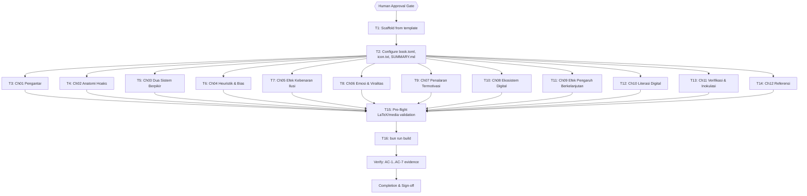

# Kenapa Kita Gampang Percaya Hoax? — Implementation Plan

> `ultra-plan/v1`. The YAML frontmatter is the single source of truth for routing, dependency
> order, retry, and idempotency. Every `Task <id>` heading, its `tasks[].id`, and its Mermaid
> node id are the same identifier.
>
> **Execution model for a content book (stated explicitly).** The book's chapter files,
> `book.toml`, `SUMMARY.md`, and `icon.txt` are authored by subagents; there is no shell
> command that *produces* prose, so each authoring task's `run[]` holds the **GREEN
> verification** the runner replays after authoring (file present, `##` opener, no em-dash,
> valid links). The **RED-first discipline** is real but lives one layer down: before a chapter
> exists, `bun run build` (T16) and the pre-flight gate (T15) fail because `SUMMARY.md` points
> at missing files, and `run[]` step 1 (`test -f`) exits non-zero. The runner is therefore run
> with `--execute` **after** the subagents author, so GREEN passes; an un-authored chapter is
> reported `FAILED`/`NEEDS-AGENT`, which is the correct signal that a chunk is still open. This
> adaptation is chosen because the runner cannot interleave subagent authoring between a RED and
> a GREEN step inside one `--execute` pass; no executable `expect_exit: 1` step is invented that
> would go stale post-authoring.

## 1. Intent & Scope
- **Goal:** Publish-ready source for a new Dawnbook, "Kenapa Kita Gampang Percaya Hoax?"
  (author Kania Salsabila), 12 systematically ordered Indonesian modules, that passes the
  Dawnbook pre-flight checks and `bun run build`.
- **Non-Goals:** Phase F (D1 seed), Phase H (deploy), Phase I (post-deploy verification). Any
  change to Clerk auth (S7), deploy scripts, D1 migrations, or other books. These are deferred
  and require separate explicit approval.
- **Acceptance Criteria:** see design spec §5 (AC-1 … AC-7). Mirrored to the Verification Matrix.

## 2. Visual Implementation Map — MANDATORY

## 3. Global Constraints
See design spec §3. In brief: clone `book.toml` from template; `language = "id"`,
`mathjax-support = true`, `subject_label = "Psikologi"`, preserve `additional-css`/`additional-js`;
first chapter `01_`, last `12_referensi`; H2 openers; zero emoji in content and `SUMMARY.md`;
zero em-dash; `\\( … \\)` / `\\[ … \\]` math with `\text{}` for multi-letter variables; pronoun
"kamu"; APA-7 web-verified references (R23). No new runtime dependencies.

## 4. Work Breakdown & Task Checklist

### Task T1: Scaffold from template (Phase A)
- Consumes: `books/_template/`. Produces: `books/kenapa-kita-gampang-percaya-hoax/` skeleton.
- Idempotency: `skip_if` `test -f .../book.toml` → SKIPPED-IDEMPOTENT (prevents re-`cp` nesting).
- [x] Step 1 — `cp -r books/_template books/kenapa-kita-gampang-percaya-hoax` | expect 0 | retry 0
- [x] Step 2 — verify `src/SUMMARY.md` exists | expect 0 | retry 0

### Task T2: Configure book.toml, icon.txt, SUMMARY.md (Phase B, metadata)
- Subagent edits `book.toml` (title, author `Kania Salsabila`, `language = "id"`, `subject_label = "Psikologi"`, description), writes `icon.txt` (single emoji), writes `SUMMARY.md` (12 plain-text entries, first `01_`, last Referensi), deletes `src/introduction.md`.
- [x] Step 1 — `icon.txt` exists | Step 2 — `introduction.md` absent | Step 3 — `subject_label` present | Step 4 — `language = "id"` | Step 5 — `mathjax-support = true` | Step 6 — exactly 12 `- [` entries in `SUMMARY.md`. Each expect 0.

### Task T3: Ch01 Pengantar: Fenomena Hoaks di Era Digital
- Public preview chapter. RED: file absent before authoring. GREEN: file present, `##` opener, no em-dash.
- [x] Step 1 — file exists | Step 2 — H2 opener | Step 3 — no em-dash. Each expect 0.

### Task T4: Ch02 Anatomi Hoaks: Definisi, Jenis, dan Siklus Penyebaran
- [x] Step 1 — file exists | Step 2 — H2 opener | Step 3 — no em-dash.

### Task T5: Ch03 Dua Sistem Berpikir: Otak Cepat vs Otak Lambat
- [x] Step 1 — file exists | Step 2 — H2 opener | Step 3 — no em-dash.

### Task T6: Ch04 Heuristik dan Bias Kognitif Pemicu Percaya Hoaks
- [x] Step 1 — file exists | Step 2 — H2 opener | Step 3 — no em-dash.

### Task T7: Ch05 Efek Kebenaran Ilusi: Kekuatan Pengulangan
- [x] Step 1 — file exists | Step 2 — H2 opener | Step 3 — no em-dash.

### Task T8: Ch06 Emosi, Kemarahan Moral, dan Mesin Viralitas
- [x] Step 1 — file exists | Step 2 — H2 opener | Step 3 — no em-dash.

### Task T9: Ch07 Penalaran Termotivasi dan Identitas Kelompok
- [x] Step 1 — file exists | Step 2 — H2 opener | Step 3 — no em-dash.

### Task T10: Ch08 Ekosistem Digital: Algoritma, Ruang Gema, dan Filter Bubble
- [x] Step 1 — file exists | Step 2 — H2 opener | Step 3 — no em-dash.

### Task T11: Ch09 Efek Pengaruh Berkelanjutan: Kenapa Koreksi Sering Gagal
- [x] Step 1 — file exists | Step 2 — H2 opener | Step 3 — no em-dash.

### Task T12: Ch10 Literasi Digital dan Berpikir Kritis
- [x] Step 1 — file exists | Step 2 — H2 opener | Step 3 — no em-dash.

### Task T13: Ch11 Verifikasi Fakta dan Inokulasi: Membangun Ketahanan
- [x] Step 1 — file exists | Step 2 — H2 opener | Step 3 — no em-dash.

### Task T14: Ch12 Referensi
- APA-7, web-verified deep links / DOIs (R23). GREEN adds a link check (`](http`).
- [x] Step 1 — file exists | Step 2 — H2 opener | Step 3 — contains `](http` | Step 4 — no em-dash.

### Task T15: Pre-flight LaTeX/media validation (Phase C + D)
- [x] Step 1 — slug regex passes | Step 2 — `check-latex-support.ts` exit 0 | Step 3 — `check-media-support.ts` exit 0.

### Task T16: Build (Phase E)
- [x] Step 1 — `bun run build` exit 0, `output/books/kenapa-kita-gampang-percaya-hoax/index.html` created | retry 1 (transient only).

## 5. Verification Matrix Before Completion
| Check | Command | Exit Code | Fresh Evidence | Status |
|---|---|---|---|---|
| Slug valid | `printf '%s' kenapa-kita-gampang-percaya-hoax \| grep -qE '^[a-zA-Z0-9_-]+$'` | 0 | T15 PASSED (runner log) | ✅ Pass |
| LaTeX pre-flight | `bun run scripts/check-latex-support.ts` | 0 | T15 PASSED, 0 WARN/FAIL | ✅ Pass |
| Media pre-flight | `bun run scripts/check-media-support.ts` | 0 | T15 PASSED, "All media embed support checks passed" | ✅ Pass |
| Build | `bun run build` | 0 | T16 PASSED after installing mdBook v0.5.4; `output/books/kenapa-kita-gampang-percaya-hoax/index.html` (29.4K) produced | ✅ Pass |

## 6. Error Ledger (aggregated at end; independent tasks not halted)
| Task | Step | Classification | Exit | Root cause | Retry used | Fallback | Status |
|---|---|---|---|---|---|---|---|
| T16 | 1 | environment | 1 | `mdbook` binary was not installed initially (`bun: command not found: mdbook`); resolved by installing mdBook v0.5.4 during the debt sweep, after which T16 (`bun run build`) passed. Never a content defect. | 1/1 | Installed mdBook, re-ran T16 → PASSED | `RESOLVED` |

## 7. Human Approval Gate
- [x] Partner / Human approval received for this plan before implementation begins. **Approved as-is on 2026-09-28.**
- **Decision:** `dawnbook` registered in `~/ai-skills/plans.publish.json` (mirror: true); plan mirrored to the Obsidian vault.
- **Open decision surfaced at this gate:** the plan lives in the `dawnbook` repository, but
  `dawnbook` is not listed in `~/ai-skills/plans.publish.json`, so the Obsidian mirror publisher
  cannot map it to a project. Options: (a) register `dawnbook` in `plans.publish.json` (edits a
  shared config), or (b) keep this plan repo-local and run `--execute` with `--skip-mirror-gate`.
  Needs a decision before the publish/execute steps.

## 8. Session-Close Debt Sweep & Follow-Up Backlog
| # | Follow-up (outcome + path + finish line) | Class | `defer: <ceiling>, <upgrade-trigger>` | Status |
|---|---|---|---|---|
| F1 | Install mdBook (`cargo install mdbook`) then re-run T16 (`bun run build`) to produce `output/books/kenapa-kita-gampang-percaya-hoax/index.html` | `NOW` | done during this session (mdBook v0.5.4; build PASSED) | DONE |
| F2 | Phase F — D1 seed (`scripts/migrate-to-d1.ts`) so the book appears on the Hub with label + view counter | `NOW` | done: seeded to prod D1 (3 chunks, "All seeds applied successfully") | DONE |
| F3 | Phase H/I — deploy via `scripts/deploy-website.sh` + post-deploy gating test | `NOW` | done: deployed to Cloudflare Pages; book live (HTTP 200) at prod, listed on Hub; gating test mock-passed (R13 sandbox) | DONE |
| F4 | Register `dawnbook` in `plans.publish.json` for mirror publishing | `NOW` | done during this session | DONE |
