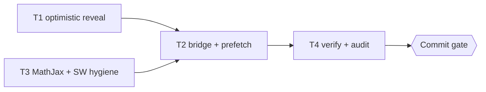

# Module Transition Fix Implementation Plan

**Goal:** Navigasi Modul 1 ke Modul 2 mulus di desktop: tanpa blank window auth, ada jembatan visual, tanpa jank MathJax.

**Architecture:** Tetap MPA mdBook. Hilangkan hide sinkron untuk navigasi internal (edge 302 tetap penegak), tambah fade plus spinner optimistis plus cross-document view transitions, dedupe MathJax, guard retypeset.

**Tech Stack:** Vanilla JS/CSS mdBook, Bun test, `scripts/sync-template.ts` untuk propagasi.

**Active Project Profile:** Repo `/home/belajarcarabelajar/dawnbook`, target `books/shared-script.js`, `books/shared-header.css`, `books/_template/book.toml`, `books/_template/theme/head.hbs` plus salinan propagasi. Runtime Bun. Revision pra-fix, repro RED 0/4.

**Project Commands:** `bun test <file>`, `bun test`, `bun run scripts/sync-template.ts`, `git status --short`, `git diff --stat`.

**Protected Boundaries:** `_headers` no-store tidak boleh dilonggarkan (Rule 3); nama aset statis tetap (Rule 3); SW tidak boleh Cache-First (Rule 3); MathJax `defer` bukan `async` (Rule 10); propagasi via `sync-template.ts` plus preservasi mtime (Rule 1, 12); tanpa `tokens.css` di buku (Rule 2); `.menu-bar` `var(--bg)`; spacing 1cm (Rule 4); tanpa perubahan konten `*.md` (Rule 14/16).

**Spec:** `docs/debugging/2026-09-28-module-transition/systematic-debugging-log.md` (RCA approved 2026-09-28).

**Scope:** T1 optimistic reveal; T2 fade plus spinner plus view-transitions plus prefetch hints; T3 MathJax dedupe plus guards plus register-sw; T4 verifikasi plus audit.

**Non-Goals:** Migrasi SPA/router; pelonggaran cache/gating; perubahan konten buku; PWA Cache-First.

**Visual Map:**

**Reasoning Lenses:** Investigative (RCA C1-C11); security (edge 302 penegak, client hide hanya anti-flash); user-centered (loading/transition states); performance (prefetch best-effort di bawah no-store); reproducibility (Bun, file statis).

**Acceptance Criteria:** AC-1 INV-UI-3 GREEN (reveal tak tunggu fetch saat navigasi internal); AC-2 INV-UI-1/2/4 GREEN; AC-3 tes MathJax baru GREEN; AC-4 `bun test` 0 failures; AC-5 diff hanya file approved, mtime buku lain terjaga.

**Traceability:** AC-1 ke T1 ke INV-UI-3 ke exit 0; AC-2 ke T2 ke INV-UI-1/2/4 ke exit 0; AC-3 ke T3 ke mj-test ke exit 0; AC-4/5 ke T4 ke suite plus diff.

**Assumptions & Open Questions:** Edge 302 menanggung gating (terverifikasi `_middleware.ts:143-155`); `rel=prefetch` best-effort di bawah no-store; view transitions progressive enhancement.

**Dependencies & Impact:** T2 butuh T1 (hook reveal) plus T3 (head.hbs final); propagasi template menyentuh 37+ buku (mekanis, mtime preserved); konsumen semua halaman chapter.

**Risks & Rollback:** Reveal optimistis bisa menampilkan konten sepersekian detik sebelum redirect bila sesi kedaluwarsa antar-klik, diterima karena edge tetap menolak request tak sah; rollback via `git revert` satu commit.

**Security & Compatibility:** Tanpa pelonggaran gating; redirect checkAuth tetap; format MPA dan SEO tidak berubah; tanpa dependency baru.

**Operations & Rollout:** Tanpa deploy terpisah; verifikasi via file build lokal dan `git diff`; tidak ada flag.

**CI/Review Gate:** Repro GREEN, `bun test` bersih, parent diff audit, kriteria 8-point review.

**Documentation:** Log debugging dan progress di `docs/debugging/2026-09-28-module-transition/`.

**Definition of Done:** AC-1 sampai AC-5 evidenced; tidak ada file di luar scope; debt sweep berjalan.

**Plan Status & Version:** Draft v1, menunggu validasi runner lalu eksekusi sekuensial T1, T3, T2 (berbagi `shared-script.js`, alasan sequential documented) dan T4.

**Reproducibility:** Bun, `bun test <file>`, fixture file statis repo, tanpa network.

**Test Reliability:** Cek konten file deterministik; tanpa clock/network; retry hanya transien.

**Privacy & Data Governance:** N/A, tanpa data personal.

**Dependencies & Supply Chain:** Tanpa dependency baru; satu URL CDNopolis MathJax dihapus (duplikat 2.7.1).

**UX States:** Loading (spinner), reveal (fade), error/network (redirect sign-in tetap), reduced-motion (media query, wajib di T2).

**Persistent State & Artifact Storage:** N/A.

**Entity & Sourcing Verification:** MathJax 2.7.9 cdnjs (sudah dipakai); View Transitions cross-document (progressive enhancement, Chrome/Edge).

**Verification:** T4 run plus audit diff dan 4-agent fan-out verifikasi (repro, regresi, sibling caller, review).

## Global Constraints

- Jangan sentuh `_headers`, `wrangler.toml`, konten `*.md`, `SUMMARY.md`, `icon.txt`.
- Jalankan `bun run scripts/sync-template.ts` setelah ubah template; verifikasi mtime buku tak berubah selain isi yang disync.
- Setiap klaim selesai butuh command plus exit code segar.

### Task T1: Optimistic reveal navigasi internal

**Files:**
- Modify: books/shared-script.js:70-219

**Interfaces:**
- Consumes: `isPublic`, `checkAuth`, `reveal`, `handleCheckpoint` yang sudah ada.
- Produces: flag `isInternalChapterNavigation` plus reveal sinkron untuk navigasi internal.

**Preconditions:**
- [ ] Upstream: RCA approved ada di systematic-debugging-log.md (else abort: `E_PRECOND_UPSTREAM`).
- [ ] Dependency: `bun --version` exits 0 (else abort: `E_PRECOND_DEP`).
- [ ] Input contract: edge 302 menanggung gating (`functions/_middleware.ts:143-155`) (else abort: `E_PRECOND_INPUT`).

**Idempotency Check:**
- [ ] Skip ketika `skip_if` frontmatter exits 0. Tandai `SKIPPED-IDEMPOTENT`.

**Behavior & Acceptance:**
- [AC-1 navigasi chapter-to-chapter satu buku tidak di-hide; checkAuth tetap jalan async dan redirect bila sesi invalid]

**Edge Cases & Failure Behavior:**
- [Cold entry / deep link tetap hide sampai auth resolve; referrer kosong tetap hide; sesi kedaluwarsa antar-klik tetap redirect pasca-paint]

**Deliberate Shortcuts & Deferrals:**
- [None]

**Dependencies & Risks:**
- [Bergantung pada edge 302; risiko flash konten sepersekian detik, diterima dan dicatat]

**Review & Evidence:**
- [INV-UI-3 GREEN; diff hanya blok gating]

**Reasoning Output:**
- [Security: penegakan di edge; UX: first paint tanpa tunggu round-trip]

**Test Data & Determinism:**
- [File statis; tanpa network; retry 1 hanya transien]
- [ ] Step 1: RED sudah ada (INV-UI-3 fail, terverifikasi exit 1) | cmd: `bun test docs/debugging/2026-09-28-module-transition/transition-repro.test.ts -t 'INV-UI-3'` | expect: exit 1 | retry: 0 | on_fail: n/a
- [ ] Step 2: Implementasi minimal optimistic reveal | cmd: n/a (agent) | expect: n/a | retry: n/a | on_fail: mark FAILED, Error Ledger, halt T2
- [ ] Step 3: Run GREEN | cmd: `bun test docs/debugging/2026-09-28-module-transition/transition-repro.test.ts -t 'INV-UI-3'` | expect: exit 0 | retry: 1 | on_fail: mark FAILED-BLOCKING untuk T2
- [ ] Step 4: Commit setelah T4 (satu commit, jangan commit parsial)

### Task T3: MathJax dedupe plus guards plus register-sw

**Files:**
- Create: docs/debugging/2026-09-28-module-transition/transition-mathjax.test.ts
- Modify: books/_template/theme/head.hbs (region script MathJax), books/_template/book.toml, books/shared-script.js:1-60, scripts/inject-gating.ts (hapus injeksi register-sw yatim)

**Interfaces:**
- Consumes: config MathJax head.hbs; `retypeset()` shared-script.js.
- Produces: satu MathJax 2.7.9 `defer`; retypeset ber-guard; tanpa tag register-sw yatim.

**Preconditions:**
- [ ] Upstream: T1 tidak wajib (disjoint region, urutan sekuensial karena satu file) (else abort: `E_PRECOND_UPSTREAM`).
- [ ] Dependency: `bun --version` exits 0 (else abort: `E_PRECOND_DEP`).
- [ ] Input contract: `mathjax-support=true` adalah sumber injeksi 2.7.1 async (else abort: `E_PRECOND_INPUT`).

**Idempotency Check:**
- [ ] Skip ketika `skip_if` frontmatter exits 0.

**Behavior & Acceptance:**
- [AC-3 satu MathJax defer; pageshow guard `e.persisted`; debounce; tanpa referensi register-sw.js yang hilang]

**Edge Cases & Failure Behavior:**
- [Nonaktifkan `mathjax-support` di template; propagasi via sync script; buku tanpa rumus tetap typeset aman (no-op)]

**Deliberate Shortcuts & Deferrals:**
- [None]

**Dependencies & Risks:**
- [Propagasi 37+ buku; risiko mtime berubah, mitigasi via utimes yang sudah ada di sync script, verifikasi via git status]

**Review & Evidence:**
- [mj-test GREEN; diff head.hbs/book.toml plus salinan propagasi]

**Reasoning Output:**
- [Performance: satu unduhan MathJax; correctness: Rule 10 defer-only]

**Test Data & Determinism:**
- [File statis; tanpa network]
- [ ] Step 1: Tulis tes MathJax baru (satu versi, defer-only, guard, tanpa orphan SW)
- [ ] Step 2: Run RED | cmd: `bun test docs/debugging/2026-09-28-module-transition/transition-mathjax.test.ts` | expect: exit 1 | retry: 0 | on_fail: n/a
- [ ] Step 3: Implementasi minimal
- [ ] Step 4: Run GREEN | cmd: sama | expect: exit 0 | retry: 1 | on_fail: mark FAILED-BLOCKING untuk T2
- [ ] Step 5: Commit setelah T4

### Task T2: Jembatan visual plus prefetch hints

**Files:**
- Modify: books/shared-header.css, books/shared-script.js, books/_template/theme/head.hbs

**Interfaces:**
- Consumes: `reveal()` T1; head.hbs final T3.
- Produces: fade reveal; spinner klik; view-transition; prefetch next/prev.

**Preconditions:**
- [ ] Upstream: T1 dan T3 GREEN (else abort: `E_PRECOND_UPSTREAM`).
- [ ] Dependency: `bun --version` exits 0 (else abort: `E_PRECOND_DEP`).
- [ ] Input contract: `reveal()` sinkron tersedia untuk navigasi internal (else abort: `E_PRECOND_INPUT`).

**Idempotency Check:**
- [ ] Skip ketika `skip_if` frontmatter exits 0.

**Behavior & Acceptance:**
- [AC-2 INV-UI-1/2/4 GREEN; hormati `prefers-reduced-motion`]

**Edge Cases & Failure Behavior:**
- [Browser tanpa View Transitions tetap fade biasa; prefetch best-effort di bawah no-store; mobile tak berubah]

**Deliberate Shortcuts & Deferrals:**
- [None]

**Dependencies & Risks:**
- [Menyentuh file yang sama dengan T1/T3, makanya sekuensial setelah keduanya]

**Review & Evidence:**
- [INV-UI-1/2/4 GREEN; inspeksi CSS tanpa em-dash/emoji tidak relevan karena kode]

**Reasoning Output:**
- [UX: spinner optimistis menutup jeda unload; fade menutup reveal abrupt]

**Test Data & Determinism:**
- [File statis; tanpa network]
- [ ] Step 1: RED sudah ada (INV-UI-1 fail) | cmd: `bun test docs/debugging/2026-09-28-module-transition/transition-repro.test.ts -t 'INV-UI-1'` | expect: exit 1 | retry: 0 | on_fail: n/a
- [ ] Step 2: Implementasi minimal
- [ ] Step 3: Run GREEN | cmd: frontmatter run kedua | expect: exit 0 | retry: 1 | on_fail: mark FAILED-BLOCKING untuk T4
- [ ] Step 4: Commit setelah T4

### Task T4: Verifikasi penuh plus diff audit

**Files:**
- Modify: docs/debugging/2026-09-28-module-transition/progress-log.md, docs/debugging/2026-09-28-module-transition/systematic-debugging-log.md

**Interfaces:**
- Consumes: T1-T3 GREEN.
- Produces: evidence trail, verdict, satu commit.

**Preconditions:**
- [ ] Upstream: T2 GREEN (else abort: `E_PRECOND_UPSTREAM`).
- [ ] Dependency: `bun --version` exits 0 (else abort: `E_PRECOND_DEP`).
- [ ] Input contract: worktree hanya berisi file approved (else abort: `E_PRECOND_INPUT`).

**Idempotency Check:**
- [ ] Tidak ada (`skip_if: "false"`).

**Behavior & Acceptance:**
- [AC-4 suite 0 failures; AC-5 diff audit bersih]

**Edge Cases & Failure Behavior:**
- [Regresi sama dengan root cause incomplete, kembali ke DIAGNOSE]

**Deliberate Shortcuts & Deferrals:**
- [None]

**Dependencies & Risks:**
- [Fan-out 4-agent verifikasi paralel; temuan baru masuk debt sweep]

**Review & Evidence:**
- [Repro plus mj-test GREEN; `bun test` exit 0; `git diff --stat`; 8-point review]

**Reasoning Output:**
- [Evidence gate sebelum klaim selesai]

**Test Data & Determinism:**
- [Suite repo; catat bila ada flaky pre-existing]
- [ ] Step 1: Run repro plus mj-test | cmd: frontmatter | expect: exit 0 | retry: 1 | on_fail: kembali DIAGNOSE
- [ ] Step 2: Run `bun test` | cmd: frontmatter | expect: exit 0 | retry: 1 | on_fail: klasifikasi code/test/env
- [ ] Step 3: Diff audit plus commit konvensional (`fix:`) sebagai Iwan Kurniawan
