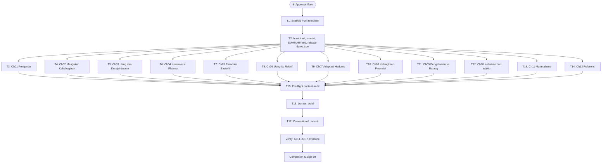

# Dawnbook: Pengaruh Uang terhadap Kebahagiaan (12 modul, author Iwan Kurniawan)

## 1. Context and Active Project Profile

- **Repository root:** `/home/belajarcarabelajar/Proyek/dawnbook` (branch `main`, clean at planning time).
- **Stack/toolchain:** Bun >= 1.2 (runtime, package manager), mdBook (static site generator, `~/.cargo/bin/mdbook`), Cloudflare Pages + D1 (hosting/data), Python 3 (aux scripts).
- **Build/verify commands (verified from `package.json`):** `bun run build` (`scripts/build.ts`), `bun test` (`test:audit`), `bun run scripts/sync-template.ts`, `bun run scripts/migrate-to-d1.ts` (Phase F, needs `~/cloudflare/.env`), `bash scripts/deploy-website.sh` (Phase H, needs creds).
- **Plan tooling:** runner and publisher live in `/home/belajarcarabelajar/ai-skills` (`bun scripts/ultra-plan-runner.mjs`, `bun scripts/plan-publish.mjs`); dawnbook owns the plan.
- **Precedent:** `docs/code-plan/plans/2026-09-28-dawnbook-kenapa-kita-gampang-percaya-hoax.md` (same task shape, 12 SUMMARY entries, T1 scaffold to T16 build).
- **Research base:** `research/2026-09-30-uang-dan-kebahagiaan.md` (15 verified sources with DOIs; section anchors cited per module below).

## 2. Design: book identity and module architecture

- **Slug:** `pengaruh-uang-terhadap-kebahagiaan`
- **Title:** Pengaruh Uang terhadap Kebahagiaan
- **Author:** Iwan Kurniawan (git identity per AGENTS.md Rule 18: `Iwan Kurniawan <iwan@belajarcarabelajar.com>`, no co-author trailer)
- **subject_label:** `Psikologi` (default; owner may override to `Keuangan` at the approval gate)
- **description (book.toml, target 100-160 chars):** `Membedah bukti ilmiah hubungan uang dan kebahagiaan: plateau pendapatan, paradoks Easterlin, adaptasi hedonis, belanja bijak, dan materialisme.`
- **icon.txt:** single emoji `💰` (only file allowed to contain emoji, Rule 14)
- **MathJax:** the platform's `scripts/sync-template.ts` overwrites every book's `[output.html.print]` + `[output.html]` section from `books/_template/book.toml` (so `mathjax-support` lands as `false`, same as every existing book incl. struktur-pasar); MathJax itself is loaded for all books via `theme/head.hbs` (`defer`, Rule 10). Verified in build output: ch03 HTML contains MathJax + tex2jax and the `ln(P)` formula. T2 therefore checks MathJax presence in `head.hbs`, not the book.toml key.
- **12 SUMMARY entries** = 11 content chapters + Referensi. Chapters address the reader as "kamu" (never "Anda"), zero emoji, zero em-dash (Rule 16), 6-8 KB house length (Rule 20; hard bounds 3.5-12 KB in run[]), varied openers and transition bridges, and a per-chapter closing section with a title assigned below (no verbatim repetition, Rule 21).

| # | File (`src/content/`) | Title | Closing section title | Research anchors |
|---|---|---|---|---|
| 01 | `01_uang-dan-pertanyaan-tua-tentang-kebahagiaan.md` | Pengantar: Uang dan Pertanyaan Tua tentang Kebahagiaan | Benang Merah | §1, §2 |
| 02 | `02_bagaimana-ilmu-mengukur-kebahagiaan.md` | Bagaimana Ilmu Mengukur Kebahagiaan | Inti Pembahasan | §1 |
| 03 | `03_uang-dan-kesejahteraan-berjalan-beriringan.md` | Bukti Utama: Uang dan Kesejahteraan Berjalan Beriringan | Poin Kunci | §2 |
| 04 | `04_kontroversi-plateau-75-ribu-dolar.md` | Kontroversi Plateau 75 Ribu Dolar | Ringkasan | §3 |
| 05 | `05_paradoks-easterlin-negara-kaya-belum-tentu-bahagia.md` | Paradoks Easterlin: Negara Kaya Belum Tentu Bahagia | Kesimpulan Bab | §4 |
| 06 | `06_uang-itu-relatif-tetangga-status-dan-perbandingan.md` | Uang Itu Relatif: Tetangga, Status, dan Perbandingan | Yang Perlu Kamu Ingat | §4 |
| 07 | `07_adaptasi-hedonis-nikmat-yang-selalu-mengendur.md` | Adaptasi Hedonis: Nikmat yang Selalu Mengendur | Intisari | §5 |
| 08 | `08_kelangkaan-finansial-kurang-uang-menyita-pikiran.md` | Kelangkaan Finansial: Ketika Kurang Uang Menyita Pikiran | Recap | §5 |
| 09 | `09_membeli-pengalaman-bukan-barang.md` | Membeli Pengalaman, Bukan Barang | Poin Penting | §6 |
| 10 | `10_membeli-kebaikan-dan-membeli-waktu.md` | Membeli Kebaikan dan Membeli Waktu | Key Takeaways | §6 |
| 11 | `11_materialisme-harga-dari-mengejar-harta.md` | Materialisme: Harga dari Mengejar Harta | Penutup | §6 |
| 12 | `12_referensi.md` | Referensi | (none) | all |

Referensi requirements (Rule 15): every entry verified via web search at authoring time, APA-7 style, each with a deep markdown hyperlink or DOI resolution link; source list starts from the 15 sources in the research report.

## 3. Global Constraints

Clone `book.toml` from template; set `language = "id"`, `subject_label = "Psikologi"`, SEO `description` (Rule 8); preserve template `additional-css`/`additional-js` paths. MathJax reaches the book via `theme/head.hbs` (see §2); do not hand-edit `[output.html]` keys, sync-template owns them. First chapter `01_`, last `12_referensi`; every chapter file opens with an H2 `## ` line identical to its SUMMARY entry. Zero emoji in content and `SUMMARY.md` (icon.txt excepted), zero em-dash, pronoun "kamu" only. LaTeX per Rules 9/10/16 where formulas appear (ch03 only). No new runtime dependencies; no modification to shared platform files beyond `release-dates.json` (append new slug key only). D1 seed (Phase F) and deploy (Phase H/I) are post-plan follow-ups requiring `~/cloudflare/.env` credentials, same as the precedent plan's debt sweep.

## 4. Mermaid Dependency Graph

## 5. Work Breakdown & Task Checklist

### Task T1: Scaffold from template (Phase A)
- Consumes `books/_template/`, produces `books/pengaruh-uang-terhadap-kebahagiaan/` skeleton.
- Idempotency: `skip_if` re-runs `test -f book.toml`; SKIPPED-IDEMPOTENT prevents re-`cp` nesting.
- [ ] Step 1 — `cp -r books/_template books/pengaruh-uang-terhadap-kebahagiaan` | expect 0 | retry 0
- [ ] Step 2 — verify `src/SUMMARY.md` exists | expect 0 | retry 0

### Task T2: Configure book.toml, icon.txt, SUMMARY.md, release-dates.json (Phase B)
- Edits `book.toml` (title, authors, `language = "id"`, `subject_label = "Psikologi"`, `mathjax-support = true`, SEO description 100-160 chars), writes `icon.txt` (💰), writes `SUMMARY.md` (12 entries, first `01_`, last Referensi), deletes `src/introduction.md`, appends slug key to `release-dates.json` (pinnedMs = authoring date epoch ms).
- [ ] Step 1 — `icon.txt` exists | Step 2 — `introduction.md` absent | Steps 3-6 — title, authors, subject_label, language in `book.toml` | Step 7 — MathJax present in `theme/head.hbs` | Steps 8-9 — description length in (100, 160) | Step 10 — exactly 12 `- [` entries | Step 11 — `jq` release-dates key > 0. Each expect 0, retry 0.

### Task T3: Ch01 Pengantar: Uang dan Pertanyaan Tua tentang Kebahagiaan
- Module contract: research report section 1-2 anchors; closing section title `Benang Merah`; opener device is a relatable money-happiness paradox scenario.
- [ ] Step 1 — file exists | Step 2 — H2 opener | Step 3 — no em-dash | Step 4 — no "Anda" | Step 5 — size >= 3500 B | Step 6 — size <= 12000 B. Each expect 0, retry 0.

### Task T4: Ch02 Bagaimana Ilmu Mengukur Kebahagiaan
- Module contract: SWB components, Cantril ladder, experience sampling; closing title `Inti Pembahasan`; opener device is a question.
- [ ] Step 1 — file exists | Step 2 — H2 opener | Step 3 — no em-dash | Step 4 — no "Anda" | Step 5 — size >= 3500 B | Step 6 — size <= 12000 B. Each expect 0, retry 0.

### Task T5: Ch03 Bukti Utama: Uang dan Kesejahteraan Berjalan Beriringan
- Module contract: positive income-well-being evidence, log-linear form (Killingsworth 2021); closing title `Poin Kunci`; opener device is a data point; may carry the log display formula (div-wrapped).
- [ ] Step 1 — file exists | Step 2 — H2 opener | Step 3 — no em-dash | Step 4 — no "Anda" | Step 5 — size >= 3500 B | Step 6 — size <= 12000 B. Each expect 0, retry 0.

### Task T6: Ch04 Kontroversi Plateau 75 Ribu Dolar
- Module contract: Kahneman-Deaton 2010 vs Killingsworth 2021, adversarial collaboration 2023; closing title `Ringkasan`; opener device is the two-headline paradox.
- [ ] Step 1 — file exists | Step 2 — H2 opener | Step 3 — no em-dash | Step 4 — no "Anda" | Step 5 — size >= 3500 B | Step 6 — size <= 12000 B. Each expect 0, retry 0.

### Task T7: Ch05 Paradoks Easterlin: Negara Kaya Belum Tentu Bahagia
- Module contract: Easterlin 1974, Stevenson-Wolfers 2008, aspiration explanation; closing title `Kesimpulan Bab`; opener device is a country-comparison observation.
- [ ] Step 1 — file exists | Step 2 — H2 opener | Step 3 — no em-dash | Step 4 — no "Anda" | Step 5 — size >= 3500 B | Step 6 — size <= 12000 B. Each expect 0, retry 0.

### Task T8: Ch06 Uang Itu Relatif: Tetangga, Status, dan Perbandingan
- Module contract: Luttmer 2005 neighbors effect, income rank, positional goods; closing title `Yang Perlu Kamu Ingat`; opener device is a neighbor scenario.
- [ ] Step 1 — file exists | Step 2 — H2 opener | Step 3 — no em-dash | Step 4 — no "Anda" | Step 5 — size >= 3500 B | Step 6 — size <= 12000 B. Each expect 0, retry 0.

### Task T9: Ch07 Adaptasi Hedonis: Nikmat yang Selalu Mengendur
- Module contract: Brickman 1978 lottery winners, hedonic treadmill, focusing illusion (Kahneman 2006); closing title `Intisari`; opener device is the lottery-winner paradox.
- [ ] Step 1 — file exists | Step 2 — H2 opener | Step 3 — no em-dash | Step 4 — no "Anda" | Step 5 — size >= 3500 B | Step 6 — size <= 12000 B. Each expect 0, retry 0.

### Task T10: Ch08 Kelangkaan Finansial: Ketika Kurang Uang Menyita Pikiran
- Module contract: scarcity, Mani 2013 sugarcane farmers, bandwidth tax, financial stress; closing title `Recap`; opener device is a month-end budget scenario.
- [ ] Step 1 — file exists | Step 2 — H2 opener | Step 3 — no em-dash | Step 4 — no "Anda" | Step 5 — size >= 3500 B | Step 6 — size <= 12000 B. Each expect 0, retry 0.

### Task T11: Ch09 Membeli Pengalaman, Bukan Barang
- Module contract: Van Boven-Gilovich 2003, why experiences win (identity, memory, comparison); closing title `Poin Penting`; opener device is a purchase-regret anecdote.
- [ ] Step 1 — file exists | Step 2 — H2 opener | Step 3 — no em-dash | Step 4 — no "Anda" | Step 5 — size >= 3500 B | Step 6 — size <= 12000 B. Each expect 0, retry 0.

### Task T12: Ch10 Membeli Kebaikan dan Membeli Waktu
- Module contract: Dunn-Aknin-Norton 2008 prosocial spending, Whillans 2017 buying time; closing title `Key Takeaways`; opener device is a 5-dollar experiment.
- [ ] Step 1 — file exists | Step 2 — H2 opener | Step 3 — no em-dash | Step 4 — no "Anda" | Step 5 — size >= 3500 B | Step 6 — size <= 12000 B. Each expect 0, retry 0.

### Task T13: Ch11 Materialisme: Harga dari Mengejar Harta
- Module contract: Kasser-Ryan 1993, extrinsic goals crowding out intrinsic ones, practical financial well-being synthesis; closing title `Penutup` (final content chapter); opener device is a contradiction between desire and outcome.
- [ ] Step 1 — file exists | Step 2 — H2 opener | Step 3 — no em-dash | Step 4 — no "Anda" | Step 5 — size >= 3500 B | Step 6 — size <= 12000 B. Each expect 0, retry 0.

### Task T14: Ch12 Referensi
- APA-7 entries, every citation web-verified with deep link/DOI (Rule 15). GREEN adds the `](http` link check.
- [ ] Step 1 — file exists | Step 2 — H2 opener | Step 3 — contains `](http` | Step 4 — no em-dash. Each expect 0, retry 0.

### Task T15: Pre-flight content audit (Phase C + D)
- [ ] Step 1 — slug regex passes | Step 2 — zero duplicate `## ` headings across content files (Rule 21) | Step 3 — `detect-emojis.ts` clean | Step 4 — `check-latex-support.ts` exit 0 | Step 5 — `check-media-support.ts` exit 0. Steps 4-5 retry 1 (transient), others retry 0.

### Task T16: Build (Phase E)
- [ ] Step 1 — `bun run build` exit 0 | retry 1 (transient only)
- [ ] Step 2 — `output/books/pengaruh-uang-terhadap-kebahagiaan/index.html` exists | expect 0 | retry 0

### Task T17: Conventional commit
- [ ] Step 1 — `git add` book dir, `release-dates.json`, research report, plan file | expect 0 | retry 0
- [ ] Step 2 — commit as `Iwan Kurniawan <iwan@belajarcarabelajar.com>`, no co-author trailer | expect 0 | retry 0
- [ ] Step 3 — verify `git log -1` author identity | expect 0 | retry 0

## 6. Acceptance Criteria & Verification Matrix

| AC | Criterion | Check | Evidence target |
|---|---|---|---|
| AC-1 | Book scaffolded with valid template config | T1/T2 steps exit 0 | runner log |
| AC-2 | 12 SUMMARY entries, first `01_`, last Referensi | T2 step 10 | runner log |
| AC-3 | All 12 content files: H2 opener, no em-dash, no "Anda", 3.5-12 KB | T3-T14 steps | runner log |
| AC-4 | Zero emoji in content; icon.txt holds exactly one emoji | T15 step 3 | runner log |
| AC-5 | No duplicate non-topical headings across chapters | T15 step 2 | runner log |
| AC-6 | Build green, book HTML produced | T16 steps | `bun run build` output |
| AC-7 | Commit authored as Iwan Kurniawan, no co-author trailer | T17 step 3 | `git log -1` |

## 7. Human Approval Gate

- [x] Partner / Human approval received for this plan before implementation begins. **Approved 2026-09-30** (option "Setuju, jalankan" + subject_label decision: `Psikologi`).
- **Decision change (v2, 2026-09-30):** T2 step 7 changed from `grep mathjax-support = true` in book.toml to `grep MathJax` in theme/head.hbs. Cause: `sync-template.ts` forces the `[output.html]` section from the master template on every build (measured: build rewrote the key to `false`, first execution run failed at T2 step 7 with exit 1), and MathJax loads via head.hbs for all books. No scope change; the check now asserts the real mechanism.
- Publish gate: `bun scripts/plan-publish.mjs <plan.md>` ran from `~/ai-skills` (a) after `Validation: OK` (published as Draft, source_hash fe9adea26aee) and (b) after approval before `--execute`. Registry fix applied at publish time: dawnbook root updated to `/home/belajarcarabelajar/Proyek/dawnbook` in `plans.publish.json` (repo moved; same action as precedent plan F4).
- Post-plan follow-ups (deferred to debt sweep, need `~/cloudflare/.env`): D1 seed (`bun run scripts/migrate-to-d1.ts`), deploy (`bash scripts/deploy-website.sh`), GSC reindex (`python3 scripts/gsc_trigger_reindex.py`), release date verification.

## 8. Error Ledger (aggregated at end; independent tasks not halted)

| Task | Step | Classification | Exit | Root cause | Retry used | Fallback | Status |
|---|---|---|---|---|---|---|---|

## 9. Session-Close Debt Sweep & Follow-Up Backlog

| # | Follow-up (outcome + path + finish line) | Class | `defer: <ceiling>, <upgrade-trigger>` | Status |
|---|---|---|---|---|
| F1 | Phase F D1 seed: `set -a && source ~/cloudflare/.env && set +a && bun run scripts/migrate-to-d1.ts` so the book row, subject label, and view counter exist | `NOW` | deferred until plan execution completes; trigger: deploy session | Pending |
| F2 | Phase H/I deploy + post-deploy verification: `bash scripts/deploy-website.sh` then HTTP 200 check and Hub listing | `NOW` | same trigger as F1 | Pending |
| F3 | GSC reindex push: `python3 scripts/gsc_trigger_reindex.py` | `NOW` | after F2 | Pending |
