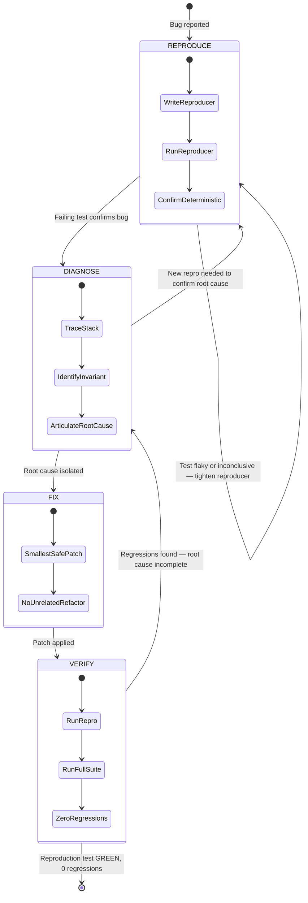

# Systematic Debugging Log: Glitch transisi Modul 1 → Modul 2 (desktop)

> Sumber template: `~/ai-skills/templates/systematic-debugging-log-template.md`.

## 1. Issue Summary

- **Reported Bug:** Pindah Modul 1 → Modul 2 via desktop cepat sampai, tapi muncul loading/glitch tidak mulus; tidak ada smart preloading atau loading spinner yang baik.
- **Environment:** Linux, repo `dawnbook`, mdBook MPA statis (`output/books/*`), commit aktif saat investigasi.
- **Affected Subsystem:** Navigasi antar-chapter buku (`books/shared-script.js`, `books/shared-header.css`, `books/_template/theme/head.hbs`, `_headers`, `scripts/build.ts`).

## 1b. Debugging Loop



## 2. Phase 1 — Deterministic Reproduction (Failing Test First)

- **Minimal Reproducer Test / Command:**
  ```bash
  bun test docs/debugging/2026-09-28-module-transition/transition-repro.test.ts
  ```
- **Observed Failure Output:**
  ```
  (fail) INV-UI-1: next-chapter prefetch hook exists in shared-script.js
  (fail) INV-UI-2: loading spinner/skeleton or page transition exists
  (fail) INV-UI-3: page reveal is not gated on a blocking network fetch
  (fail) INV-UI-4: head template ships prefetch/preload hints for chapter assets
  0 pass, 4 fail — exit 1, stabil di 3 run beruntun.
  ```
- **Confirmation:** [x] Confirmed fails deterministik untuk alasan yang dilaporkan.
- **Catatan kalibrasi:** INV-UI-3 sempat false-pass karena `/api/auth/me` muncul di komentar (baris ~66) sebelum statement hide; diperbaiki dengan anchor `fetch('/api/auth/me'` vs `document.documentElement.style.opacity = '0'`.

## 3. Phase 2 — Root Cause Analysis (RCA)

- **Execution Trace (navigasi Modul 1 → Modul 2, chapter gated, desktop):**
  1. Klik link next → full-document reload MPA (tidak ada router; `books/shared-script.js` tidak memanggil `pushState`/fetch+swap — C6 CONFIRMED).
  2. Dokumen baru diparse; IIFE gating berjalan di akhir `<body>`: `!isPublic` → `documentElement.opacity=0, visibility=hidden` sinkron (`shared-script.js:87-90` — C1).
  3. `checkAuth()` mengirim `GET /api/auth/me`; `reveal()` hanya di `.then` (`:196-207`). Tanpa timeout/fast-path (`:209-215` — C1). Blank window = 1 round-trip auth.
  4. Reveal abrupt tanpa transisi CSS (`:92-97`, C3); tidak ada spinner/skeleton (`shared-header.css` penuh, `head.hbs` — C3).
  5. Pasca-reveal: MathJax ganda (2.7.9 `defer` + 2.7.1 `async` bawaan mdBook, parent-verified di output HTML) + 3-6x `Typeset` tanpa guard (`shared-script.js:30-59` — C4) → kedip rumus; append progress-bar/back-to-hub saat `DOMContentLoaded` (`:221-261` — C9) → reflow susulan; `<script src="/register-sw.js">` yatim, file tidak ada (parent-verified) → 404 tiap load.
- **Violated Invariant:** Navigasi antar-modul harus menjaga kontinuitas visual: tidak ada paint tersembunyi yang menunggu jaringan, tidak ada reveal abrupt, tidak ada re-layout tanpa guard.
- **Root Cause Explanation:**
  - PRIMER: hide-until-auth-fetch. Tiap pindah modul membayar `GET /api/auth/me` dengan dokumen disembunyikan. Ini satu-satunya fetch yang meng-gate reveal (C5 membuktikan fetch checkpoint/progress fire-and-forget pasca-reveal).
  - ARSITEKTURAL: MPA full reload tanpa jembatan visual (nol prefetch milik sendiri — C2 + grep parent; hint `rel="next prefetch"` bawaan mdBook lumpuh oleh `Cache-Control: no-store` pada `/books/*` — C10 + verifikasi parent) dan nol loading indicator (C3).
  - SEKUNDER (amplifier jank): MathJax duplikat versi + retypeset tanpa debounce (C4, C11); mutasi DOM saat `DOMContentLoaded` (C9); 404 `register-sw.js` (temuan parent).
  - RULED OUT: fetch checkpoint/progress (C5), font FOUT Syne/Epilogue karena font tidak pernah di-fetch di halaman buku (C7), CLS gambar pada sampel `quarter-life-crisis` (C8, satu buku), init sidebar/theme bawaan mdBook (C9), rantai render-blocking selain 2 additional-css (C11).
- **Kontradiksi yang diselesaikan dari bukti:** (a) C2 vs C6: keduanya benar di level berbeda — hint prefetch ada di output build (bawaan mdBook) tapi nol logika di source; (b) C9 "tidak ada HTML build" salah — `output/books/*` ada (terbukti via `ls` parent), temuan source-nya tetap valid; (c) C5 mengalihkan tuduhan C1 secara tepat: bukan checkpoint, melainkan auth.
- **Status:** ⏸️ Menunggu approval eksplisit sebelum patch apa pun.

## 4. Phase 3 — Smallest Safe Localized Fix

- **Target File(s):** `books/shared-script.js` (T1 gating + T3 debounce + T2 bridge IIFE), `books/shared-header.css` (fade + overlay), `books/_template/theme/head.hbs` + propagasi 37+ buku (preconnect/preload/view-transition), `books/_template/book.toml` + propagasi 50+ buku (`mathjax-support=false`), `scripts/inject-gating.ts` (-1 baris register-sw), `scripts/check-latex-support.ts` (akui provider manual MathJax), red-chunk: hapus `crossorigin` preload (V4 P2).
- **Fix Description:** Optimistic reveal navigasi internal (edge 302 tetap enforcer); jembatan visual fade+spinner+prefetch; satu MathJax defer ber-guard; hapus 404 register-sw.
- **Patch Preview:** `git diff --stat`: 110 file, +384/-66 (mayoritas propagasi 1-3 baris uniform); inti: `shared-script.js`, `shared-header.css`, `head.hbs`, `book.toml`, `inject-gating.ts`, `check-latex-support.ts`.

## 5. Phase 4 — Regression Verification

- **Reproduction Test Status:**
  - Command: `bun test docs/debugging/2026-09-28-module-transition/`
  - Output: Exit 0, 8 passed, 0 failed.
- **Full Suite Status:**
  - Command: `bun test`
  - Output: Exit 1, 332 passed, 13 skipped, 1 failed — fail tunggal `tests/functions/lib/auth.test.ts` (last_seen_at role), pre-existing ordering flake: solo run exit 0, nol overlap file dengan diff.
- **LaTeX gate:** `bun run scripts/check-latex-support.ts` exit 0, All checks passed.
- **Verdict:** [x] Bug resolved with 0 regressions (1 pre-existing flake dicatat, bukan dari diff).
